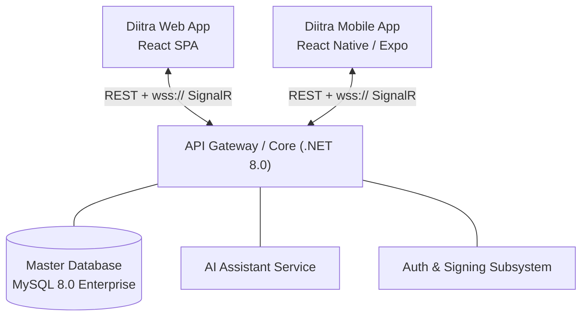

# DIITRA
**Departamento de Investigación e Innovación Traversari**

    

> **DIITRA** es un sistema para la administración del ciclo de vida integral de proyectos de investigación. Automatiza los flujos institucionales desde la captación del proponente, hasta la protección final de la Propiedad Intelectual.

---

## Tabla de Contenidos Automática
1. [Panorama del Sistema](#panorama-del-sistema)
2. [Arquitectura Tecnológica High-Level](#arquitectura-tecnológica-high-level)
3. [Arquitectura Nuclear & TRL 2026](#arquitectura-nuclear--trl-2026)
4. [Mapeo de Dominios Core](#mapeo- de-dominios-core)
5. [Documentación Técnica (Tiers)](#documentación-técnica-tiers)
6. [Guía de Despliegue Empresarial](#guía-de-despliegue-empresarial)

---

## Panorama del Sistema
DIITRA implementa altos y modernos estándares de la industria del software. Mediante la centralización estricta bajo dominios de datos interconectados y una fuerte adherencia a metodologías ágiles, la plataforma garantiza:

- **Full Auditability**: Cada cambio de estado genera un rastro inmutable requerido para CACES y Contraloría General del Estado.
- **Doble Ciego (Peer Review)**: Capacidad intrínseca de protección de perfiles inter-institucionales.
- **Observabilidad Proactiva**: Soporte embebido y conectividad total para telemetría organizacional.

## Arquitectura Tecnológica High-Level

El ecosistema transaccional se compone de tres nodos cardinales:



## Arquitectura Nuclear & TRL 2026
Recientemente se ha integrado la **Arquitectura Nuclear**, diseñada para cumplir con los estándares de excelencia institucional 2026:

- **Metadata-Driven Core**: Persistencia flexible mediante JSON para tipologías de productos y evidencias.
- **TRL Engine**: Motor de seguimiento de niveles de madurez tecnológica (**TRL 1-9**).
- **Resilient Workflow Engine**: Máquina de estados 100% configurable por base de datos (Zero-Code).
- **Forensic Audit Snapshots**: Persistencia de datos históricos inmutables en cada documento emitido.
- **Project Temporal Extensions**: Sistema de trazabilidad para prórrogas y cambios de vigencia legal.
- **Omnichannel Notification Hub**: Motor de notificaciones desacoplado con soporte para múltiples drivers (Email, App, etc).
- **Vinculación Productiva**: Módulo de gestión de entidades aliadas y convenios externos.
- **Catálogos Dinámicos**: Gestión centralizada de tipos de investigación, productos y rúbricas.

## Mapeo de Dominios Core

| Dominio                   | Descripción Corta                                                                 | SLA Target |
|---------------------------|-----------------------------------------------------------------------------------|------------|
| **Project Management**    | Gestión y radicación de presupuestos, actas y metodologías.                       | 99.9%      |
| **Innovation & Analytics**| Registro de intangibles (patentes), transferencia tecnológica.                    | 99.5%      |
| **Security & Identity**   | Zero-Trust model, Magic Links, y gestión dinámica mediante PBAC.                  | 99.99%     |

## Documentación Técnica (Tiers)

Esta documentación ha sido sectorizada para simplificar el onboarding de equipos *DevOps*, *SecOps* y *Frontend/Backend Engineers*:

### » Nivel Arquitectura & Infraestructura
- [01 - System Design & C4 Architecture](./docs/documentacion/01_arquitectura.md)
- [02 - Data Governance & Database Modeling](./docs/documentacion/02_base_datos.md)
- [12 - Arquitectura Nuclear & TRL 2026](./docs/documentacion/12_arquitectura_nuclear_trl.md)

### » Nivel Capas de Aplicación
- [03 - Backend Enterprise API (C#, .NET)](./docs/documentacion/03_backend.md)
- [04 - Frontend Web App (React) Performance](./docs/documentacion/04_frontend_web.md)
- [05 - Frontend Mobile App (Expo) Lifecycle](./docs/documentacion/05_frontend_mobile.md)

### » Nivel Procesos de Negocio
- [06 - Flujos de Trabajo Transaccionales & Secuencias](./docs/documentacion/06_flujos_trabajo.md)
- [07 - Detalle de Arquitecturas Técnicas](./docs/documentacion/07_arquitecturas_detalle.md)
- [08 - Motor de Documentos & Compliance](./docs/documentacion/08_motor_documentos.md)

---

## Guía de Despliegue Empresarial

### CI/CD Pipeline (Overview)
Se recomienda estructurar repositorios con integración hacia **GitHub Actions** o **Azure DevOps**. El *trunk-based development* rige en `main` que lanza pipelines automatizados para compilación en la imagen Docker.

> [!WARNING]
> La ejecución local asume permisos de conexión habilitados en el host hacia la instancia unificada de la base de datos `sigafi_es`.

### Secuencia de Arranque Local

```bash
# 1. API Services
cd backend/diitra_api
dotnet restore
dotnet run --launch-profile "diitra_api"

# 2. Web Client Dashboard
cd ../../diitra_web
npm ci # Uso de CI para lockfile estricto en entorno corporativo
npm run dev

# 3. Mobile Companion
cd ../../diitra_mobile
npm ci
npx expo start -c # El flag -c limpia caché previniendo estados anómalos
```
