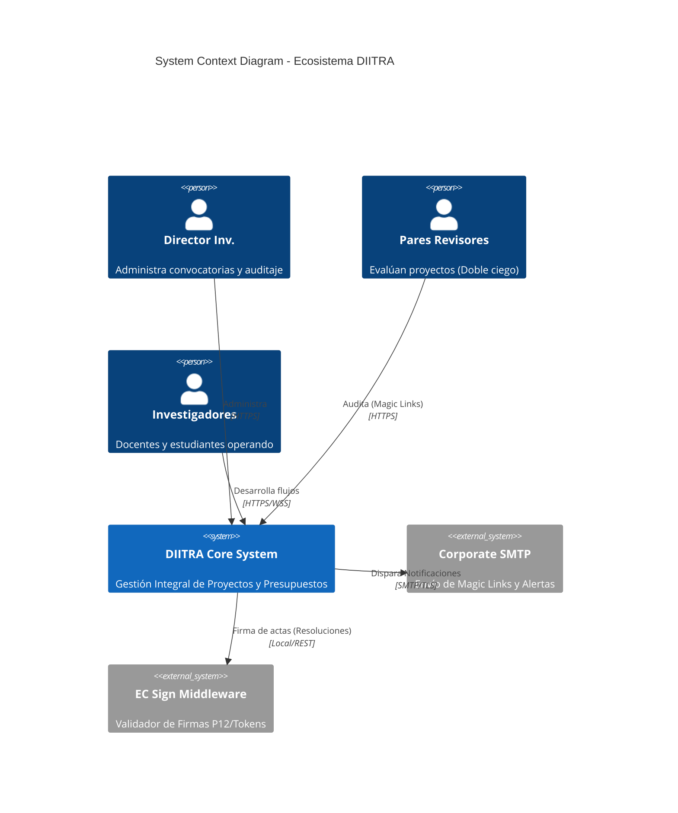

# Enterprise System Design & C4 Architecture

DIITRA implementa una variante pulida del patrón **Monolito Modular** diseñado con **Clean Architecture**. Esta directriz permite una escalabilidad predictiva en empresas de alto nivel de demanda con mínima disrupción.

## Modelo C4: Nivel Contexto & Contenedores (Nivel 1 y 2)

El Modelo C4 ayuda al equipo corporativo a visualizar la arquitectura desde una perspectiva estandarizada. 

## Clean Architecture: Desglose de Inversión de Dependencias (DI)

El Backend de DIITRA desacopla rigurosamente sus librerías de clase asegurando mantenibilidad corporativa superior:

-  **diitra_domain (Enterprise Business Rules)**: Puro código agnóstico; ni rastro de referencias a BD ni Entity Framework. Solo entidades (`inv_proyectos`), enumeraciones (`Permissions`) e interfaces core.
- **diitra_application (Application Business Rules)**: Comandos de casos de uso (Handlers), Interfaces de servicios (`IAuthService`). 
- **diitra_infrastructure (Frameworks & Web)**: Capa de cruce contra Entity Framework Core y servicios perimetrales estables (`AIAssistantService`, implementaciones de Redis o SMTP).
- **diitra_api (Presentation Layer)**: Endpoints REST, WebSockets, mapeos de Middleware, Controladores puros (`Controllers/`).

## Patrones de Computación y Abstracciones Nivel Enterprise

### 1. Unit of Work (Transaccionalidad Atómica)
Se evita la fuga de datos transaccionales forzando el commit general al final de la manipulación de entidades (`DiitraContext`). Si un proyecto aprueba pero falla la creación asíncrona de las notificaciones, interviene el rollback.

### 2. Time-coupled Communication (SignalR)
El sistema abandona el _Poling_ tradicional a favor de los WebSockets de larga duración mediante Azure SignalR o Self-hosted WebSockets que empujan la telemetría a usuarios concurrentes durante su trabajo colaborativo (Ej: Modificación del Cronograma simultáneo).

### 3. Observabilidad e Instrumentación (Logging / OpenTelemetry)
> [!IMPORTANT]
> A nivel corporativo, el stack incluye adaptabilidad para recolección de logs estructurados en **JSON**. Un componente vital para integrar con plataformas APM (Application Performance Monitoring) modernas como ELK Stack, Datadog o Grafana.
Se exige que toda falla no procesada (unhandled exception filter) se estructure conteniendo: `Request ID`, `UserId`, `TraceId` y el componente originario.
