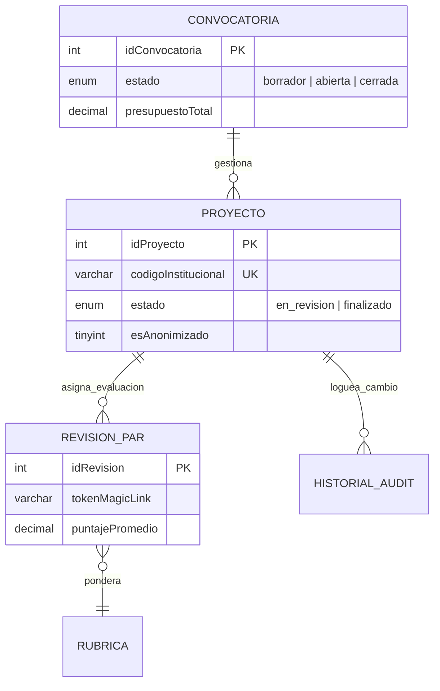

# Gobernanza y Modelado de la Base de Datos

DIITRA utiliza un modelo de persistencia relacional en un RDBMS **MySQL 8.0+**. Está optimizado para la velocidad en cargas de escritura concurrentes con transaccionalidad ACID probada.

## 📊 Arquitectura de Persistencia y Gobernanza
Dado que el ecosistema maneja datos del presupuesto y procesos gubernamentales auditables a nivel estatal (Ej: Transferencias de Inv. y Resoluciones), la directriz obedece a políticas estrictas de data governance.

### 1. Integridad Referencial Mixta (`inv_` Prefixing)
El sistema coexiste en el entorno del histórico `sigafi_es`. A fin de no impactar la estructura legacy en producción, todas las tablas maestras y catálogos de DIITRA poseen el prefijo `inv_`.
> [!TIP]
> **Data Segregation:** Esta segregación lógica previene bloqueos por mutación de filas de otros microservicios operando sobre SIGAFI.

### 2. Trazabilidad y Auditabilidad Histórica
El esquema central de diseño jamás realiza operaciones **DELETE**. Todas las filas poseen un flag binario `activo (TINYINT)`. 
La tabla **`inv_proyectos_historial`** funge orgánicamente el rol de un Registro de Inmutabilidad, anotando automáticamente desde la subcapa de infraestructura todos los cambios de transición de estados `(borrador -> en_ejecucion -> finalizado)`.

## 🗂️ Entidades Logísticas Core (Diagrama Intermedio)

Para entendimiento corporativo, las dependencias cruciales de módulos viajan de la siguiente manera:

## 🔐 Políticas DRP (Disaster Recovery Plan) Básicas Recomendadas
A nivel empresarial, al manipular bases de datos tan unificadas:
1. **Replicación Maestro/Esclavo**: DIITRA debería leer metadatos pesados de `inv_productos` desde nodos réplica de solo lectura para evitar sobrecargar la base escribiente principal.
2. **Encriptación At-Rest**: Los campos de autenticación se confían pero los P12 generados (paths) deben residir sobre blobs cifrados o ubicaciones fuera del storage relacional por buena práctica.
