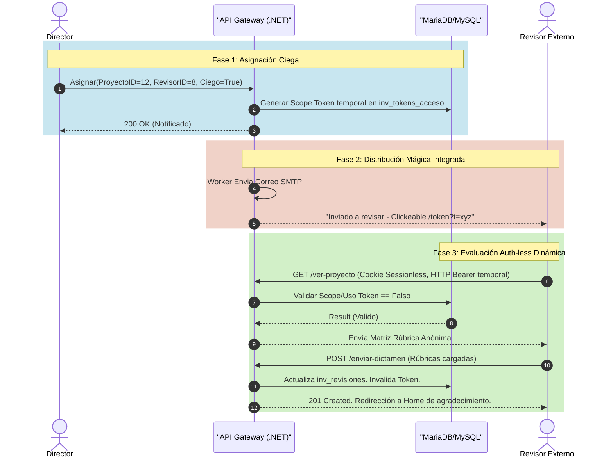
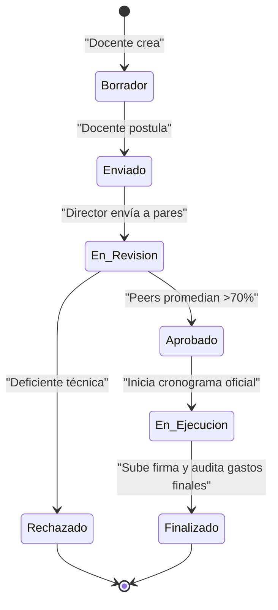
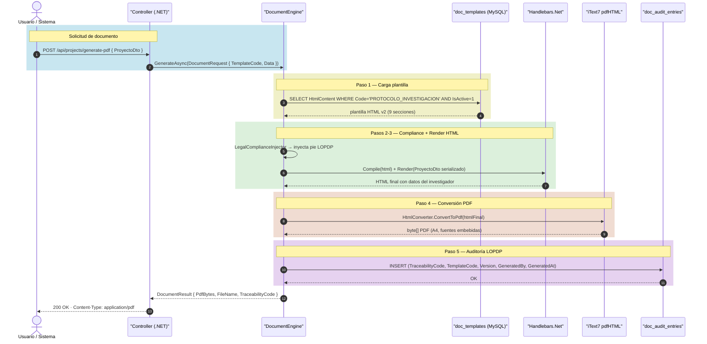
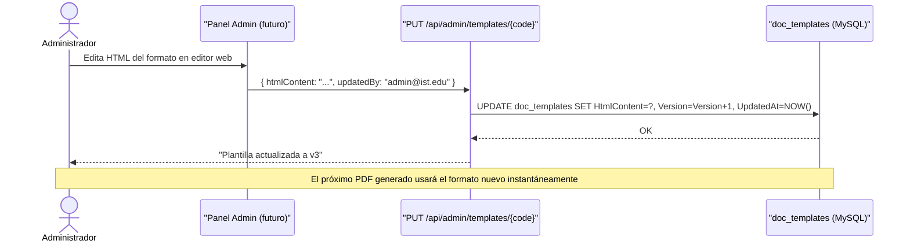

# Flujos y Diagramas Transaccionales (BPMN / Sequence)

En ecosistemas complejos, detallar textualmente no es suficiente. El sistema procesa los modelos de dominio según secuencias predefinidas de actor/validación.

## Sequence: Ejecución "Double Blind Peer Review"

El componente más crítico académicamente. Exige validación, seguridad asincrónica vía "Magic Token" y resolución de estados.

## Trazabilidad del Proyecto (Diagrama de Estados FSM)

Todo el avance burocrático de un *Proyecto de Innovación* puede resumirse en la máquina de estados gestionada y blindada por backend en su historia.

Estas mutaciones se registran invariablemente en la tabla `inv_proyectos_historial` a manera de event-sourcing lite, previniendo alteraciones silenciadas por administradores o agentes intermedios.

---

## Sequence: Generación de Documento PDF (Motor DIITRA)

Flujo completo desde que un controlador solicita un PDF hasta que el usuario lo descarga.

## Flujo: Actualización de Plantilla sin Redespliegue

