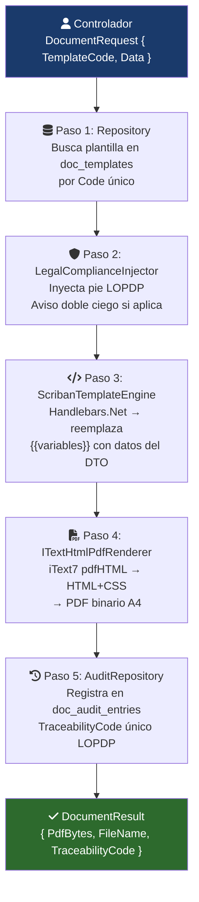

# 07 - Detalle de Arquitecturas DIITRA

Este documento proporciona una visión profunda y técnica de los patrones arquitectónicos implementados en el ecosistema DIITRA, asegurando que cualquier desarrollador futuro comprenda las decisiones de diseño tomadas para cumplir con la normativa SENESCYT/CACES.

---

## 1. Backend: Clean Architecture (Onion)
El backend utiliza **.NET 8.0** siguiendo una arquitectura de capas concéntricas donde el núcleo (Domain) es agnóstico a la tecnología.

### Capas y Responsabilidades:
1.  **Domain (Núcleo):** 
    *   **Contenido:** Entidades (`Proyecto`, `Presupuesto`), Objetos de Valor, Excepciones de Dominio e Interfaces de Repositorio.
    *   **Regla:** No tiene dependencias externas. Es puro C#.
2.  **Application (Lógica de Negocio):**
    *   **Contenido:** Servicios de aplicación (`ProjectService`), DTOs, Mapeos y Validaciones (`FluentValidation`).
    *   *Patrón:* Se recomienda el uso de **MediatR** para desacoplar comandos y consultas si el sistema crece en complejidad.
3.  **Infrastructure (Implementación):**
    *   **Contenido:** Contexto de base de datos (`DiitraContext`), implementaciones de repositorios, servicios de Firma Electrónica (.p12), y clientes de IA.
    *   **Tecnología:** Entity Framework Core con MySQL.
4.  **API (Capa de Presentación):**
    *   **Contenido:** Controladores REST, Middlewares (como el `ExceptionMiddleware`) y configuración de Inyección de Dependencias.

---

## 2. Frontend Web: Modular Layered React
La web utiliza **React 19** con **Vite** para una experiencia de desarrollo instantánea.

### Organización del Código:
*   **Pages:** Componentes que representan una ruta completa (Dashboard, Login).
*   **Components:** UI atómica y componentes de negocio reutilizables.
*   **Hooks:** Encapsulación de lógica reutilizable (ej: `useAuth`, `useProjects`).
*   **API Services:** Capa de comunicación con el backend usando Axios, con interceptores para manejar tokens de seguridad automáticamente.
*   **Collaborative Logic:** Integración con **Yjs** y **SignalR** para edición multijugador de protocolos de investigación.

---

## 3. Mobile: File-Based Expo Router
La aplicación móvil aprovecha el ecosistema de **Expo** para maximizar la productividad y el rendimiento nativo.

### Estructura de Navegación:
*   **App Directory:** Utiliza la convención de carpetas de **Expo Router**.
    *   `(auth)`: Rutas protegidas de autenticación.
    *   `(tabs)`: Navegación principal por pestañas (Inicio, Proyectos, Perfil).
*   **Shared State:** Se recomienda el uso de **Zustand** o **Context API** para estados ligeros y persistentes.
*   **Native Modules:** Uso de `expo-file-system` para manejo de certificados de firma electrónica y `expo-camera` para evidencias.

---

## 4. Base de Datos: Relational Logic Pattern
MySQL 5.7/8.0 no solo almacena, sino que protege la integridad de la investigación.

*   **Vistas de Reporte:** Centralización de consultas complejas para los indicadores del CACES.
*   **Triggers de Integridad:** Generación automática de UUIDs para asegurar que cada proyecto tenga un identificador único global antes de ser procesado por el backend.
*   **Soft Delete:** Uso de la columna `activo` para trazabilidad total, prohibiendo el borrado físico de registros auditables.

---

## 5. Parámetros de Calidad y Velocidad
*   **Rendimiento:** Se eliminó la lógica de detección de red síncrona en el arranque del backend para garantizar una respuesta inmediata.
*   **Entornos:** Se utilizan perfiles de lanzamiento (`launchSettings.json`) para diferenciar configuraciones de "Casa" y "Oficina" sin ensuciar el código con condicionales.
*   **CI/CD:** GitHub Actions automatizado para validar compilaciones en .NET 8 y Web.

---

## 6. Motor Enterprise de Documentos — Pipeline Architecture

El Document Engine opera como una **tubería de transformación** (Pipeline Pattern) donde cada paso tiene una única responsabilidad y puede reemplazarse de forma independiente.

### Capas y su intercambiabilidad

| Capa | Implementación actual | Alternativa posible |
|---|---|---|
| Motor de plantillas | Handlebars.Net | Fluid, Razor |
| Renderizador PDF | iText7 + pdfHTML | PuppeteerSharp (MIT), DinkToPdf |
| Persistencia | EF Core + MySQL | Dapper, MongoDB |
| Compliance | `LegalComplianceInjector.cs` | Extensible via Strategy Pattern |

> [!TIP]
> El contrato `IDocumentEngine` garantiza que **ningún controlador del sistema cambia** si se reemplaza cualquiera de las implementaciones internas. El código de llamada siempre es el mismo 3 líneas.
