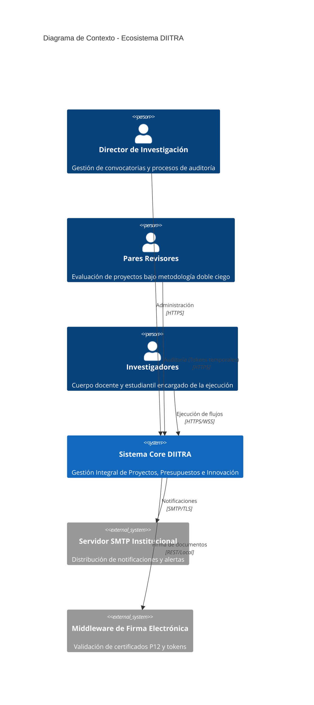

# Arquitectura de Sistema e Ingeniería de Software

DIITRA implementa una arquitectura de Monolito Modular basada en los principios de Clean Architecture (Arquitectura Limpia). Este diseño garantiza el desacoplamiento de las reglas de negocio respecto a las tecnologías de infraestructura, permitiendo una mantenibilidad a largo plazo y una escalabilidad predictiva.

## Modelo C4: Contexto y Contenedores

El sistema se visualiza mediante el estándar C4 para asegurar una comunicación técnica uniforme entre los equipos de desarrollo y auditoría.

## Clean Architecture: Desglose de Capas

El Backend se estructura en cuatro capas de responsabilidad única para asegurar la inversión de dependencias:

1. **Capa de Dominio (diitra_domain)**: Contiene las entidades nucleares (InvProyecto, InvImpacto) y las reglas de negocio fundamentales. Es agnóstica a cualquier framework o base de datos.
2. **Capa de Aplicación (diitra_application)**: Define los casos de uso del sistema. Incluye los orquestadores (IProjectOrchestrator), manejadores de comandos e interfaces de servicios.
3. **Capa de Infraestructura (diitra_infrastructure)**: Implementa el acceso a datos mediante Entity Framework Core, la generación de documentos con iText9 y la integración con servicios externos.
4. **Capa de Presentación (diitra_api)**: Expone los endpoints REST y los hubs de comunicación en tiempo real (SignalR).

## Capa de Resiliencia e Integridad Forense (Compliance CACES 2026)

Para cumplir con las normativas de acreditación de Institutos Superiores en Ecuador, se ha implementado una capa de seguridad inmutable:

- **Bloqueo de Estado (State Locking)**: Mecanismo de control en el orquestador que impide la modificación de datos una vez que el proyecto alcanza estados de revisión o aprobación.
- **Snapshots de Datos (Forensic Snapshots)**: Captura inmutable en formato JSON de la información inyectada en cada documento oficial en el momento de su emisión.
- **Validación de Trazabilidad**: Sistema de sellado SHA-256 vinculado a un nodo de verificación pública mediante códigos QR, permitiendo la auditoría externa de la integridad del archivo.

## Patrones de Diseño Corporativo

### Transaccionalidad Atómica (Unit of Work)
Se garantiza la integridad de los datos mediante el patrón Unit of Work, asegurando que todas las operaciones de persistencia (proyectos, cronogramas, presupuestos) se ejecuten en una única transacción de base de datos.

### Comunicación en Tiempo Real (SignalR)
El sistema utiliza WebSockets para la sincronización colaborativa de documentos, permitiendo que múltiples investigadores trabajen sobre un mismo protocolo con actualización instantánea de estados.

### Registro Estructurado (Structured Logging)
Implementación de logs en formato JSON para facilitar la observabilidad y el monitoreo mediante plataformas APM, registrando trazabilidad de usuarios, identificadores de solicitud y fallos del sistema.
