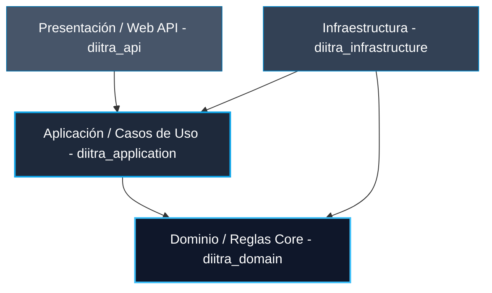
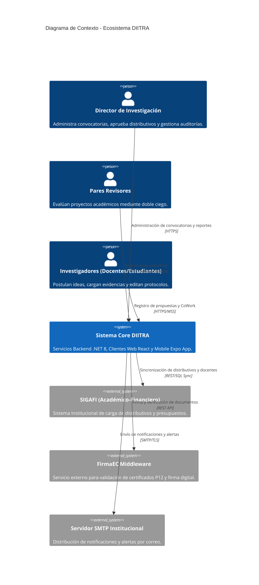

# Ecosistema DIITRA: Arquitectura de Software y Sistemas

Este documento detalla los principios de diseño de software, el desglose de capas del backend, la estructura y optimizaciones de los clientes web y móvil, y la infraestructura de comunicación colaborativa del ecosistema **DIITRA** (Sistema de Gestión Integral de Investigación, Innovación y Vinculación).

---

## 1. Diseño de Arquitectura Nuclear

DIITRA se fundamenta en una arquitectura de **Monolito Modular** y sigue los principios de **Clean Architecture (Onion Pattern)**. El objetivo principal es aislar las reglas de negocio de los detalles de infraestructura (motores de base de datos, sistemas de archivos o herramientas externas), garantizando un diseño testeable, con desacoplamiento y escalabilidad predictiva.

### Capas y Responsabilidades

*   **Capa de Dominio (`diitra_domain`)**:
    *   *Responsabilidad*: Define el núcleo del negocio. Contiene las entidades puras de C# (`InvProyecto`, `InvImpacto`), objetos de valor (`Value Objects`) e interfaces de repositorios maestros.
    *   *Regla de diseño*: No posee dependencias de frameworks externos, bibliotecas ORM o controladores de bases de datos.
*   **Capa de Aplicación (`diitra_application`)**:
    *   *Responsabilidad*: Implementa y orquesta los casos de uso. Incluye manejadores de comandos y consultas (CQRS), DTOs de comunicación y orquestadores de datos como `IProjectOrchestrator` e `IWorkflowEngineService`.
    *   *Validaciones*: Define las reglas de transición y estados de negocio mediante **FluentValidation**.
*   **Capa de Infraestructura (`diitra_infrastructure`)**:
    *   *Responsabilidad*: Provee la implementación de persistencia a base de datos (`DiitraContext` vía Entity Framework Core), el renderizado dinámico de archivos PDF binarios mediante **iText9**, compilación de plantillas HTML con **Handlebars.Net** y el middleware de integración con FirmaEC.
*   **Capa de Presentación (`diitra_api`)**: Expone los endpoints HTTP RESTful del backend y los Hubs de SignalR. Gestiona la autenticación, autorización y el mapeo de excepciones globales.

---

## 2. Modelo C4: Contexto y Contenedores

El sistema se visualiza mediante el estándar C4 para asegurar una comunicación técnica uniforme entre los equipos de desarrollo, arquitectura y auditoría externa.

---

## 3. Capa de Resiliencia e Integridad Forense (Compliance CACES 2026)

Para satisfacer las regulaciones de acreditación institucionales vigentes en el país, el orquestador implementa políticas específicas de seguridad:
*   **Bloqueo de Estado (State Locking)**: Una vez que un proyecto es transicionado a revisión por pares, aprobación o ejecución, el orquestador bloquea los comandos de modificación sobre el formulario e inhabilita las peticiones de escritura.
*   **Snapshots Forenses (Forensic Snapshots)**: Captura en formato JSON estructurado que encapsula los datos exactos del docente, presupuesto y cronograma en el momento preciso de la firma o emisión documental.
*   **Validación de Trazabilidad**: Encriptación mediante firma digital vinculada a un código hash SHA-256 e inyección de un código QR público para validación de autenticidad del documento físico sin requerir login al sistema.

---

## 4. Patrones de Diseño Corporativo y Persistencia

### Transaccionalidad Atómica (Unit of Work)

El backend asegura la coherencia del estado del negocio mediante el uso implícito y explícito de transacciones atómicas. Las modificaciones del proyecto (presupuesto, cronograma de actividades y miembros del equipo) se ejecutan bajo un único contexto de base de datos (`DbContext`), garantizando que si una operación intermedia falla, todo el bloque de cambios se revierte en base de datos.

### Servicios e Inyección de Dependencias

Se utiliza el inyector de dependencias nativo de ASP.NET Core configurado en modo **Scoped** para garantizar el aislamiento transaccional por petición HTTP:
*   `IProjectOrchestrator`: Coordina la integridad del formulario web y aplica las reglas de negocio sobre el proyecto.
*   `IWorkflowEngineService`: Controla que las transiciones de estados cumplan con la máquina de estados configurada en la base de datos.
*   `IDocumentEngine`: Genera los documentos PDF institucionales a partir de plantillas dinámicas.
*   `IAuthService`: Administra identidades y valida los permisos de acceso de usuarios (PBAC).

### Structured Logging (Serilog)

Todos los eventos significativos, excepciones no controladas y transiciones de flujos de trabajo se registran en formato JSON estructurado en consola y almacenamiento de logs. Cada registro incluye automáticamente metadatos contextuales:
*   `CorrelationId` para rastreo unificado de peticiones.
*   `UserId` y `IPAddress` del cliente solicitante.
*   `EntityId` y tipo de acción para auditoría forense.

### Recomendaciones de Seguridad a Vigilar (Backend)

*   **Llaves y Firma Electrónica (`rutaFirmaP12`)**: La columna en base de datos que almacena la ubicación del archivo `.p12` no debe exponer directorios web públicos. El servidor debe encriptar la contraseña de la firma en reposo y recuperar el archivo desde almacenamiento seguro aislado.
*   **Integridad Referencial Estricta (`ON DELETE RESTRICT`)**: Las restricciones de base de datos como la clave foránea de metadatos de usuario poseen la directriz `ON DELETE RESTRICT` hacia la tabla de usuarios core. El backend debe interceptar y manejar amigablemente las excepciones de base de datos (`DbUpdateException`) cuando un administrador intente desactivar o borrar a un usuario con histórico de investigación.

---

## 5. Frontend Web: Modular Layered React (Vite + React 19)

La aplicación del portal administrativo centralizado está desarrollada con React 19 y compilada con Vite.js utilizando ESBuild para optimizar el arranque en desarrollo y la carga atómica.

### Organización de Componentes

La estructura de archivos de la interfaz web sigue una disposición por responsabilidades y capas:
*   `Pages/`: Componentes principales que representan una vista completa mapeada por el router de React (ej: `ProjectsPage.tsx`, `UsersPage.tsx`).
*   `Components/`: Unidades de UI atómicas y de propósito general (ej: `Button.tsx`, `Modal.tsx`) junto con componentes lógicos específicos del negocio.
*   `Hooks/`: Abstracciones reutilizables de lógica de estado, llamadas asíncronas y efectos (ej: `useAuth`, `useDraft`).
*   `API Services/`: Capa dedicada a la comunicación con endpoints del backend mediante instancias configuradas de Axios.

### Optimizaciones Web (Core Web Vitals)

*   **Lazy Loading y Code Splitting**: Los módulos pesados de evaluación y visualización de rúbricas complejas se cargan bajo demanda utilizando `React.lazy` y `Suspense`, reduciendo el tamaño del paquete JavaScript del bundle de inicio.
*   **React Hook Form Context**: Para prevenir caídas de frames al digitar campos de texto extensos en las secciones del protocolo (como la Justificación), los formularios usan bindings aislados a nivel del input local, evitando el repintado innecesario de elementos ajenos del Layout (como el Header o el Sidebar).

### Seguridad y Fetching (Axios Interceptors)

El cliente intercepta de forma centralizada todas las respuestas HTTP a través de interceptores de Axios:
*   **Manejo de 401 (Unauthorized)**: Si la sesión expira o el token es inválido, el cliente borra el estado de autenticación global (almacenado en `Zustand`) y redirige automáticamente al usuario al portal de login.
*   **withCredentials**: El tráfico de red obliga la inyección de `withCredentials: true` en Axios debido al almacenamiento de los tokens JWT de sesión bajo cookies de tipo `HttpOnly` y atributo `SameSite=Strict`.

---

## 6. Frontend Mobile (Expo React Native v6)

Permite al personal docente evaluar proyectos, firmar y cargar evidencias de forma ágil desde dispositivos móviles iOS y Android.

### Expo Router (App Router)

*   **Enrutamiento Basado en Archivos**: Las pantallas se organizan dentro del directorio `/app` mapeando la navegación automáticamente a enlaces internos de la app.
*   **Deep Linking & Magic Links**: Configuración de enlaces profundos para que las alertas por correo electrónico redireccionen al docente evaluador directamente a la sección de aprobación específica dentro de su aplicación móvil instalada.

### Estrategia de Build y Despliegue (CI/CD)

*   **EAS Update (Over The Air)**: Permite enviar actualizaciones menores o parches urgentes de código JS/CSS en caliente a los dispositivos de los usuarios finales sin requerir un nuevo proceso de publicación y aprobación en las tiendas oficiales App Store y Google Play.

### Módulos Nativos y Rendimiento

*   **React Native Reanimated**: La lógica de visualización de cronogramas y transiciones utiliza animaciones fluidas que se ejecutan directamente sobre el hilo de UI nativo del sistema operativo, evitando bloqueos por congestión del puente JavaScript de React Native.

---

## 7. Motor de Edición Colaborativa (CoWork Engine)

Sincroniza en tiempo real las secciones del protocolo de investigación entre múltiples investigadores utilizando técnicas asíncronas de baja latencia.

### Tecnología de Resolución de Conflictos (CRDTs)

*   **Yjs**: El sistema gestiona las colisiones de texto simultáneas mediante Tipos de Datos Replicados Libres de Conflictos (**CRDTs**). Las modificaciones concurrentes se resuelven de manera matemática y distribuida en el navegador de cada colaborador, eliminando la necesidad de implementar bloqueos de archivos en el servidor.
*   **Eficiencia en Red**: Transmite exclusivamente deltas de cambios optimizados (codificados en binario) en lugar de cadenas de texto completas.

### Colaboración de Alta Disponibilidad y Presencia

*   **SignalR sobre WebSockets**: Permite la actualización bidireccional inmediata con tiempos de respuesta de milisegundos.
*   **Cursores Dinámicos**: Identifica visualmente a los colaboradores y muestra la ubicación de sus cursores en pantalla.
*   **Aislamiento y Anonimización**: Separa los contextos de edición por campos de texto y cuenta con soporte para anonimizar los cursores durante fases de evaluación externa.
*   **Sincronización Asíncrona**: Soporte para trabajo remoto concurrente de equipos de investigación multidisciplinarios, garantizando la persistencia local y sincronización de cambios al recuperar conexión, sin riesgo de pérdida de información.
*   **Aislamiento por Niveles / Control de Acceso Granular**: Restringe y segmenta la edición y visualización de secciones específicas del protocolo científico de acuerdo al rol asignado a cada investigador en el equipo de proyecto.

### Asistencia para la Investigación (IA & Pertinencia)

*   **Análisis de Pertinencia**: Módulo de asistencia que evalúa de forma previa la coincidencia temática de la postulación contra las líneas de investigación registradas de la institución y sus dominios académicos.
*   **Optimización Metodológica**: Sugiere mejoras estructurales e identifica inconsistencias en la redacción científica antes de la remisión formal al comité de evaluación.

---

## 8. Interoperabilidad Científica y Servicios Externos

*   **Interoperabilidad (DSpace & Dublin Core)**: El ecosistema implementa conectividad con repositorios institucionales de tesis y publicaciones utilizando protocolos de metadatos bajo el estándar **Dublin Core** para facilitar la indexación académica global.
*   **Drivers de Notificación Desacoplados**: Lógica de comunicaciones (notificaciones push, correos electrónicos SMTP y SMS) implementada mediante adaptadores aislados. Esto permite cambiar de proveedor de correos o mensajería sin tocar el núcleo de lógica de la aplicación.

---

## 9. Infraestructura, Escalabilidad y Calidad

*   **Almacenamiento Distribuido**: El almacenamiento de evidencias, fotos y documentos binarios soporta múltiples drivers (almacenamiento local, MinIO o AWS S3), permitiendo una escalabilidad de recursos de archivos separada de la base de datos relacional.
*   **Gestión de Entornos**: Uso riguroso de perfiles de configuración (`appsettings.Development.json`, `appsettings.Production.json`) para aislar cadenas de conexión de base de datos y credenciales de APIs.
*   **CI/CD (GitHub Actions)**: Pipeline de integración y despliegue continuo encargado de ejecutar pruebas unitarias automáticas, compilar binarios de .NET y validar la cobertura de código antes de autorizar el despliegue al servidor de producción.
