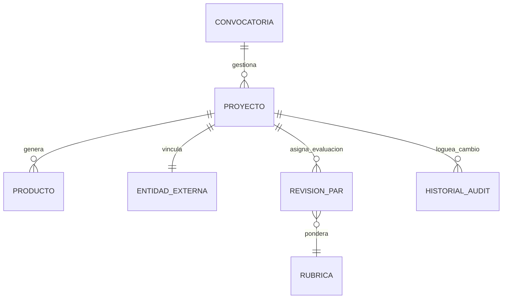

# Gobernanza y Modelado de la Base de Datos

DIITRA utiliza un modelo de persistencia relacional compatible con **MySQL 5.7 y 8.0+**. Está diseñado para garantizar la integridad mediante triggers de generación automática de UUIDs.

## Arquitectura de Persistencia y Gobernanza
Dado que el ecosistema maneja datos del presupuesto y procesos gubernamentales auditables a nivel estatal (Ej: Transferencias de Inv. y Resoluciones), la directriz obedece a políticas estrictas de data governance.

### 1. Integridad Referencial Mixta (`inv_` Prefixing)
El sistema coexiste en el entorno del histórico `sigafi_es`. A fin de no impactar la estructura legacy en producción, todas las tablas maestras y catálogos de DIITRA poseen el prefijo `inv_`.
> [!TIP]
> **Data Segregation:** Esta segregación lógica previene bloqueos por mutación de filas de otros microservicios operando sobre SIGAFI.

### 2. Trazabilidad y Auditabilidad Histórica
El esquema central de diseño jamás realiza operaciones **DELETE**. Todas las filas poseen un flag binario `activo (TINYINT)`. 
La tabla **`inv_proyectos_historial`** funge orgánicamente el rol de un Registro de Inmutabilidad, anotando automáticamente desde la subcapa de infraestructura todos los cambios de transición de estados `(borrador -> en_ejecucion -> finalizado)`.

## Entidades Logísticas Core (Diagrama Intermedio)

Para entendimiento corporativo, las dependencias cruciales de módulos viajan de la siguiente manera:

## Arquitectura Nuclear (Dynamic Catalogs)
Para el cumplimiento CACES 2026, se han implementado tablas de configuración dinámica:

### `inv_cat_tipo_producto`
Define las categorías de producción científica y tecnológica.
- `idTipoProducto` (PK)
- `Nombre`, `Categoria` (Académico, Tecnológico, etc.)
- `RequiereRegistro` (TINYINT)

### `inv_entidades_externas`
Repositorio de socios estratégicos para proyectos de innovación.
- `idEntidad` (PK)
- `RazonSocial`, `RUC`, `Tipo` (Pública, Privada, etc.)
- `ContactoEmail`

### `inv_config_indicadores`
Motor de mapeo para indicadores de acreditación nacional.
- `CodigoIndicador` (Ej: I.INV.1)
- `ValorReferencia`, `AñoNormativa`

### `inv_config_workflow`
Configuración dinámica de la máquina de estados de proyectos.
- `EstadoOrigen`, `EstadoDestino`
- `IdTipoProyecto` (Opcional para flujos específicos)
- `RolRequerido`

### `inv_proyecto_extensiones`
Registro histórico de prórrogas y cambios de plazos legales.
- `FechaAnterior`, `FechaNueva`
- `Motivo`, `Resolucion`

## Políticas DRP (Disaster Recovery Plan) Básicas Recomendadas
A nivel empresarial, al manipular bases de datos tan unificadas:
1. **Replicación Maestro/Esclavo**: DIITRA debería leer metadatos pesados de `inv_productos` desde nodos réplica de solo lectura para evitar sobrecargar la base escribiente principal.
2. **Encriptación At-Rest**: Los campos de autenticación se confían pero los P12 generados (paths) deben residir sobre blobs cifrados o ubicaciones fuera del storage relacional por buena práctica.

---

## Tablas del Motor de Documentos (Migración: `AddDocumentEngineTables`)

Añadidas el 06/05/2026 mediante EF Core migration. No llevan prefijo `inv_` ya que son parte del núcleo transversal de DIITRA, no del módulo de investigación específico.

### `doc_templates`
Almacena las plantillas HTML editables. La fuente de verdad para todos los documentos generados.

| Columna | Tipo | Descripción |
|---|---|---|
| `Id` | `int AUTO_INCREMENT` | PK |
| `Code` | `varchar(100) UNIQUE` | Identificador único. Ej: `PROTOCOLO_INVESTIGACION` |
| `Name` | `longtext` | Nombre legible |
| `Description` | `longtext NULL` | Descripción del uso |
| `HtmlContent` | `longtext` | HTML con variables Handlebars `{{variable}}` |
| `Version` | `int` | Versión actual (incrementa en cada edición) |
| `Category` | `int` | Enum: Protocolo, ActaAprobacion, InformeAvance... |
| `RequiresLopdpClause` | `tinyint(1)` | Auto-inyecta pie legal LOPDP |
| `SupportsBlindMode` | `tinyint(1)` | Soporta anonimización doble ciego |
| `RequiresTraceabilityCode` | `tinyint(1)` | Genera código único de trazabilidad |
| `RequiresElectronicSignature` | `tinyint(1)` | Reserva espacio para FirmaEC |
| `CustomCss` | `longtext NULL` | CSS adicional por plantilla |
| `IsActive` | `tinyint(1)` | Soft delete |
| `CreatedAt` | `datetime(6)` | Fecha de creación |
| `UpdatedAt` | `datetime(6)` | Fecha de última edición |
| `UpdatedBy` | `longtext NULL` | Email del administrador que editó |

### `doc_audit_entries`
Log inmutable de cada documento generado. Cumple exigencias de trazabilidad LOPDP.

| Columna | Tipo | Descripción |
|---|---|---|
| `Id` | `int AUTO_INCREMENT` | PK |
| `TraceabilityCode` | `varchar(50) UNIQUE` | Código único del documento emitido |
| `TemplateCode` | `longtext` | Code de la plantilla usada |
| `TemplateVersion` | `int` | Versión de la plantilla en el momento de emisión |
| `Category` | `int` | Categoría del documento |
| `GeneratedBy` | `longtext NULL` | Usuario que solicitó el documento |
| `GeneratedAt` | `datetime(6)` | Timestamp UTC de generación |
| `WasBlindMode` | `tinyint(1)` | Si fue emitido en modo doble ciego |

> [!NOTE]
> La tabla `doc_audit_entries` es de escritura única (append-only). Nunca se actualiza ni elimina un registro, garantizando la integridad del log de auditoría.
