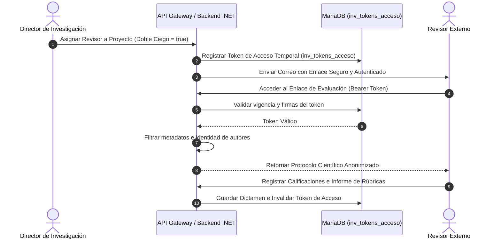
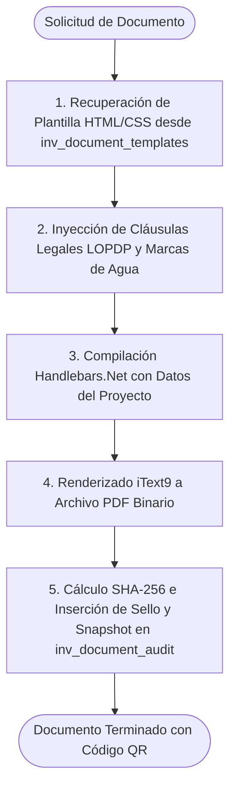
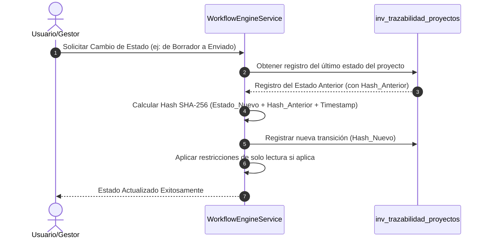

# Ecosistema DIITRA: Gobernanza de Datos, Procesos y Cumplimiento Normativo

Este documento detalla el modelado de la base de datos, los flujos secuenciales transaccionales de negocio, las reglas de validación horaria del personal docente y las especificaciones de cumplimiento normativo (CACES Criterio B.1.1, LOPDP, FirmaEC y SENADI) implementadas en el ecosistema **DIITRA**.

---

## 1. Gobernanza y Diseño de Persistencia

El almacenamiento físico de DIITRA utiliza un modelo relacional basado en **MariaDB / MySQL**. La base de datos está diseñada para garantizar la integridad referencial, el rendimiento de consulta y la inmutabilidad de los registros históricos de auditoría.

### Estándares de Datos y Estructura

*   **Segregación de Esquema (`inv_`)**: Para evitar conflictos con esquemas relacionales preexistentes de la institución (como el sistema académico SIGAFI), todas las tablas propias del dominio de investigación utilizan el prefijo `inv_`.
*   **Identificación Segura**: Se implementan identificadores universales únicos de tipo **UUID v4** en las claves públicas expuestas a las APIs e interfaces de usuario, previniendo ataques de enumeración y recolección de datos secuenciales.
*   **Estrategia de Soft Delete**: Para cumplir con los requerimientos de auditoría y trazabilidad legal, los registros nunca se borran físicamente. Se implementa la columna booleana `activo` en combinación con restricciones de clave foránea estructuradas.
*   **Codificación**: El charset de base de datos está configurado en `utf8mb4_unicode_ci`, asegurando el soporte tipográfico completo de caracteres en español y consistencia en consultas de búsqueda.

---

### Estructuras Nucleares de Datos

```
                                      +------------------------------------+
                                      |       profesores_actividades       |
                                      +------------------------------------+
                                      | IdSubcategoria (7 = Investigación) |
                                      | HorasSemana                        |
                                      +------------------------------------+
                                                        |
                                                        | (1) Distributivo SIGAFI
                                                        v
+-------------------------+          +------------------------------------+          +-----------------------+
|  inv_config_workflow    |          |      inv_proyectos_profesores      |          |  inv_document_audit   |
+-------------------------+          +------------------------------------+          +-----------------------+
| id_config_workflow (PK) |          | id_proyecto (FK)                   |          | id_audit (PK)         |
| estado_origen           |          | id_usuario (FK)                    |          | data_snapshot_json    |
| estado_destino          |          | horasSemanales (Dedicación)        |          | hash_sha256           |
| rol_autorizado          |          +------------------------------------+          | codigo_trazabilidad   |
+-------------------------+                            |                             +-----------------------+
                                                       | (2) Asignación DIITRA
                                                       v
                                      +------------------------------------+
                                      |            inv_proyectos           |
                                      +------------------------------------+
                                      | id_proyecto (PK)                   |
                                      | estado                             |
                                      | metadataCacesJson                  |
                                      +------------------------------------+
```

*   **`inv_config_workflow`**: Define la configuración dinámica de la máquina de estados, indicando qué roles de usuario están autorizados para transicionar los proyectos.
*   **`inv_document_audit`**: Almacena las firmas electrónicas, códigos de trazabilidad únicos visibles públicamente, huellas digitales SHA-256 del archivo PDF y los snapshots JSON de datos originales del proyecto.
*   **`inv_proyectos_profesores`**: Almacena la relación entre proyectos e investigadores y define las horas semanales comprometidas de dedicación en la columna `horasSemanales`.
*   **`profesores_actividades`**: Tabla de integración externa de SIGAFI que contiene la planificación del distributivo docente para investigación (`IdSubcategoria == 7`).

### Snapshots Forenses y Columnas Virtuales

El sistema implementa una política inmutable para la validez de actas oficiales. Al generar un documento de aprobación, DIITRA inserta una captura JSON (`data_snapshot_json`) en `inv_document_audit` conteniendo el estado exacto de la información del proyecto y sus investigadores. Esto asegura que si la información de un docente o presupuesto cambia en el futuro, el acta histórica firmada pueda ser reconstruida con fidelidad a su momento de emisión.

> [!TIP]
> **Optimización en MariaDB**: En lugar de deserializar campos JSON completos en consultas recurrentes de reportes para el CACES, se definen **columnas virtuales generadas e indexadas** en MariaDB vinculadas a propiedades clave del JSON, optimizando el rendimiento de base de datos.

---

## 2. Diagramas Secuenciales de Flujos de Negocio

### Proceso de Revisión por Pares (Double-Blind)

Este flujo asegura la anonimización de la información y la imparcialidad del dictamen académico:



### Pipeline de Generación de Documentos Oficiales

Lógica secuencial del motor de documentos (`IDocumentEngine`) para emitir PDFs inmutables:



*   **Administración de Plantillas**: Las plantillas base se configuran mediante código HTML y CSS en la tabla `inv_document_templates`. Esto permite a los administradores actualizar formatos de actas y resoluciones ante cambios de normativa interna, eliminando la necesidad de realizar despliegues de código nuevos.

### Orquestación de Información

El `DocumentDataOrchestrator` centraliza la recolección de datos desde múltiples fuentes antes de enviarlos al pipeline de renderizado:
1. **Datos Maestros**: Información estructurada de la base de datos (presupuestos, cronogramas de actividades e investigadores).
2. **Contenido Colaborativo**: Fragmentos de texto generados en tiempo real por el equipo de co-investigadores mediante el motor CoWork.
3. **Metadatos de Integridad**: Códigos dinámicos y UUIDs que aseguran la inmutabilidad y unicidad del documento.

### Módulo de Verificación Pública (QR Integrity)

Para facilitar los procesos de auditoría externa y acreditación institucional, DIITRA incorpora un nodo de verificación pública de documentos. Al escanear el código QR presente en el pie de página de un documento oficial emitido por la plataforma, el auditor accede a una interfaz que valida:
1. **La autenticidad del emisor**: Certificación de que el documento proviene de la entidad oficial (IST Traversari).
2. **Fecha y hora exactas** en las que el documento fue generado físicamente por el motor de plantillas.
3. **Verificación de integridad**: Comparación del hash SHA-256 del PDF impreso contra la huella persistida en el nodo de confianza.
4. **Vigencia legal**: Estado actual del proyecto dentro del ciclo de flujos y transiciones de la institución.

### Ciclo de Transición de Estados (Cadena de Custodia SHA-256)

Cada cambio de estado en el motor de flujos calcula un hash encadenado al registro anterior:



---

## 3. Módulo de Cumplimiento Legal y Normativo

### 3.1. ¿Qué exigen las autoridades (CES, CACES y SENESCYT)?

Para que la institución apruebe auditorías regulatorias, el control horario y del distributivo es mandatorio. Las exigencias se rigen por la siguiente normativa:

### A. Jornada Laboral y Funciones Sustantivas (RRA - Art. 47/48)

*   Un docente a **Tiempo Completo** cumple una jornada laboral de **40 horas semanales**.
*   Estas 40 horas se distribuyen obligatoriamente en tres funciones sustantivas: **Docencia** (clases, tutorías y planificación), **Vinculación con la Sociedad**, e **Investigación/Gestión Académica**.
*   El distributivo debe ser aprobado de forma semestral por el **Consejo Académico Superior (CAS)** de la institución. Las horas asignadas a investigación en este documento son el **límite máximo legal** que el docente puede dedicar a estas actividades.

### B. El Criterio B.1.1 del CACES (Claustro Docente y su Vinculación con la Investigación)

Durante los procesos de evaluación y acreditación institucional, los pares evaluadores del CACES realizan una auditoría estricta de cruce documental:
*   **Cruces de Información**: Los auditores comparan el **Distributivo de Horas de Investigación** aprobado por el CAS con los **Documentos Oficiales del Proyecto** (Protocolo de Investigación y Resoluciones de Aprobación).
*   **Inconsistencias**: Si un docente figura en el proyecto dedicando **12 horas semanales**, pero su distributivo aprobado indica que solo posee **6 horas**, los auditores invalidan la evidencia.

## 2. Lógica de Negocio y Flujo de Control Requerido en DIITRA

Para mitigar inconsistencias documentales de forma preventiva, DIITRA automatiza el control de carga horaria.

### Reglas de Validación a Nivel de Sistema (Backend)

Al intentar realizar una transición de estado a `"Enviado"` o `"Aprobado"`, el sistema ejecuta una validación de sobrecarga para cada uno de los docentes miembros:

#### Formulación Matemática de Disponibilidad Horaria

Para un Docente $d$ en el Período Académico $p$:

$$H_{\text{disponibles}}(d, p) = H_{\text{distributivo\_investigacion}}(d, p) - \sum_{i \in \text{ProyectosActivos}(p)} H_{\text{asignadas}}(d, i)$$

Donde:
*   $H_{\text{distributivo\_investigacion}}$ representa las horas aprobadas para investigación (`IdSubcategoria == 7` en `profesores_actividades` de SIGAFI).
*   $\text{ProyectosActivos}(p)$ son los proyectos registrados en el periodo $p$ con estados transaccionales activos (`"Enviado"`, `"En Revisión"`, `"Aprobado"`, `"En Ejecución"`).

#### Validación de Lógica en `WorkflowEngineService.cs`

El motor de flujos evalúa de forma obligatoria esta capacidad disponible antes de autorizar transiciones:

```csharp
public async Task ValidateTeacherWorkloadAsync(Guid proyectoId, int periodoId)
{
    var investigadores = await _context.InvProyectosProfesores
        .Where(p => p.IdProyecto == proyectoId)
        .ToListAsync();

    foreach (var inv in investigadores)
    {
        // 1. Obtener horas máximas de investigación asignadas en distributivo SIGAFI
        decimal horasMaxDistributivo = await _context.ProfesoresActividades
            .Where(pa => pa.IdUsuario == inv.IdUsuario && pa.IdPeriodo == periodoId && pa.IdSubcategoria == 7)
            .Select(pa => pa.HorasSemana)
            .FirstOrDefaultAsync();

        if (horasMaxDistributivo == 0)
        {
            throw new WorkloadValidationException($"El docente {inv.Usuario.NombreCompleto} no cuenta con horas de investigación aprobadas en su distributivo institucional.");
        }

        // 2. Sumar horas asignadas en otros proyectos activos en DIITRA
        decimal horasOtrosProyectos = await _context.InvProyectosProfesores
            .Where(ipp => ipp.IdUsuario == inv.IdUsuario && ipp.IdProyecto != proyectoId &&
                          (ipp.Proyecto.Estado == "Enviado" || ipp.Proyecto.Estado == "Aprobado" || ipp.Proyecto.Estado == "En Ejecución"))
            .SumAsync(ipp => ipp.HorasSemanales ?? 0);

        decimal totalComprometido = horasOtrosProyectos + (inv.HorasSemanales ?? 0);

        // 3. Evaluar sobrecarga horaria
        if (totalComprometido > horasMaxDistributivo)
        {
            throw new WorkloadValidationException(
                $"Sobrecarga horaria detectada para {inv.Usuario.NombreCompleto}. " +
                $"Máximo permitido: {horasMaxDistributivo}h. Suma total comprometida: {totalComprometido}h (Otros proyectos: {horasOtrosProyectos}h, Este proyecto: {inv.HorasSemanales}h)."
            );
        }
    }
}
```

#### Integración en la Interfaz de Usuario (Vite + React)

*   **Listado y Ficha de Docentes (`UsersPage.tsx`)**: Muestra badges de control en el perfil del docente:
    *   `SIGAFI: Xh` (horas del distributivo).
    *   `Asig: Yh` (horas comprometidas en DIITRA).
    *   `Disp: Zh` (horas libres calculadas como $SIGAFI - Asig$).
*   **Dashboard del Docente (`DocenteDashboard.tsx`)**: Renderiza una barra de progreso que indica las horas del periodo académico. Muestra alertas visuales de inactividad investigativa si el profesor no posee horas en su distributivo activo.
*   **Espacio de Trabajo del Proyecto (`ProjectWorkspace.tsx`)**: Compara la dedicación ingresada en el formulario con la capacidad disponible en tiempo real, arrojando una alerta preventiva (`⚠️ Excede límite! Máx disp: Xh`) antes de que el usuario envíe la postulación al servidor.
*   **Ficha de Grupos de Investigación (`GroupFormDrawer.tsx`)**: Muestra la etiqueta `Disp: Xh / Yh` en las sugerencias del buscador al conformar el grupo de investigación y seleccionar a sus coordinadores o docentes.

---

## 4. Clasificación, Catálogos Dinámicos y Madurez Tecnológica (TRL)

Para adaptarse de manera flexible a nuevas metodologías y exigencias del CACES sin requerir alteraciones al esquema físico de la base de datos, DIITRA incorpora las siguientes especificaciones:

*   **Motor TRL (Technology Readiness Levels)**: Soporte nativo para clasificar e instrumentar la madurez tecnológica de las propuestas mediante la escala estándar internacional **TRL (1-9)**. Esto permite segregar proyectos entre investigación básica, investigación aplicada y desarrollo experimental/transferencia.
*   **Vinculación e Innovación Productiva**: Módulo integrado para definir asociaciones de la postulación con entidades externas, capturando métricas de impacto de vinculación con la sociedad para justificar el cumplimiento de los indicadores de acreditación del instituto.
*   **Catálogos Dinámicos basados en Metadatos**: Separación estricta de catálogos y datos maestros (líneas de investigación, evidencias requeridas, ponderaciones y rúbricas de evaluación). Esto permite que el administrador actualice los catálogos normativos directamente desde la interfaz, sin alterar el código ni detener la base de datos.
*   **Trazabilidad Temporal**: Registro del ciclo de vida temporal del proyecto. Almacena de manera histórica extensiones de plazos, prórrogas aprobadas y fechas de vigencia legal de los entregables del proyecto.

---

## 5. Automatización de Criterios de Acreditación (CACES) y Normativas

### Cumplimiento de la Ley de Protección de Datos (LOPDP)

El sistema integra de forma nativa la protección de datos de carácter personal:
*   **Gestión de Cláusulas**: Inyección obligatoria de avisos de confidencialidad y cláusulas de consentimiento informado en todos los formularios públicos y documentos generados.
*   **Registro de Accesos**: Trazabilidad e historial inmutable de accesos a datos identificadores (`Read Auditing`) para cumplir ante inspecciones de la Superintendencia de Protección de Datos.

### Firma Electrónica y Validez Jurídica (FirmaEC)

Alineación completa con la Ley de Comercio Electrónico, Firmas y Mensajes de Datos de Ecuador:
*   **Firma Avanzada**: Carga de certificados `.p12` para la firma de actas de aprobación y resoluciones. Las llaves se procesan de forma aislada en memoria del servidor sin quedar expuestas a directorios públicos web.
*   **Cero Papel**: Digitalización y automatización de la firma digital de informes semestrales de avance con la misma validez jurídica del papel físico.

### Gestión de Propiedad Intelectual (SENADI)

*   **Evidencias de Autoría**: Exportación estructurada del historial criptográfico del proyecto (bitácora de cambios en `inv_trazabilidad_proyectos`, snapshots de autoría y actas firmadas digitalmente) para facilitar los trámites de registro de software y la cesión de derechos patrimoniales ante el **SENADI** (Servicio Nacional de Derechos Intelectuales).
