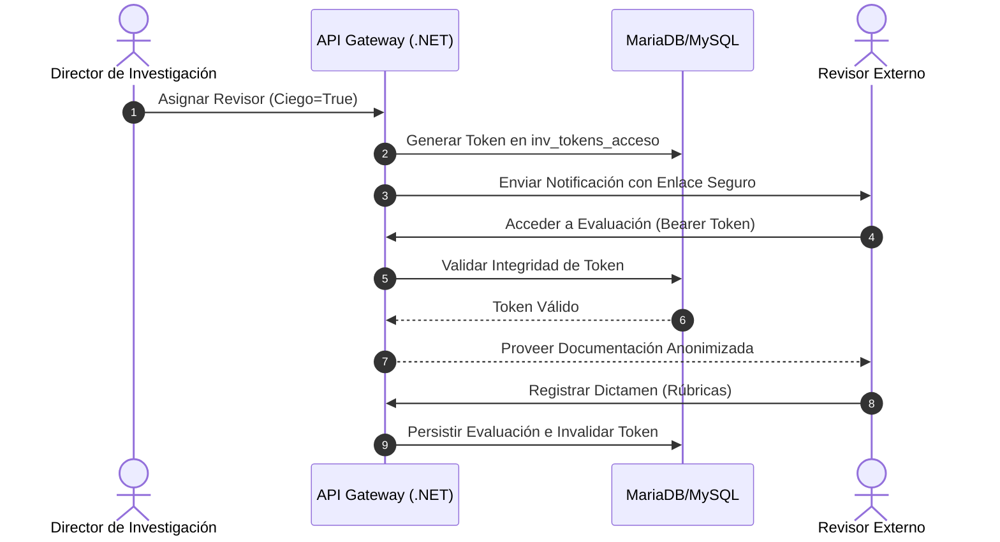
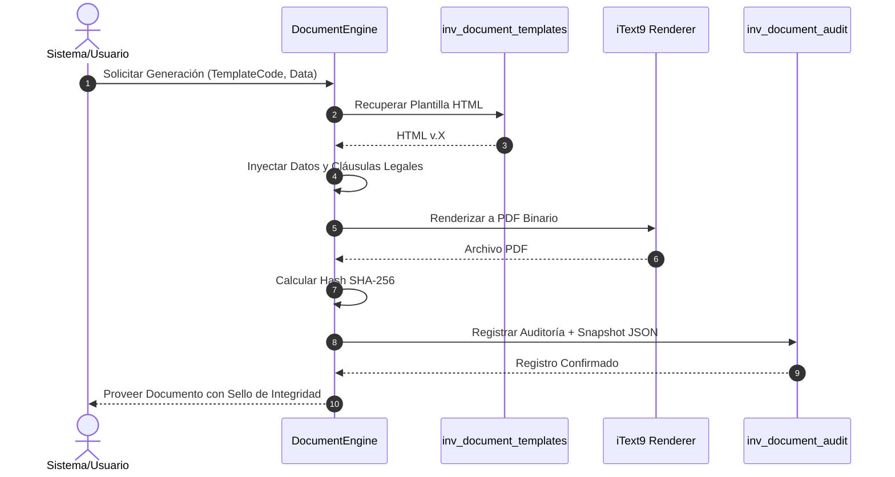

# Flujos de Trabajo y Diagramas Transaccionales

La lógica de DIITRA se describe mediante diagramas de secuencia que detallan la interacción entre los actores, los servicios de aplicación y la capa de persistencia.

## Proceso de Revisión por Pares (Double Blind Peer Review)

Este proceso garantiza la imparcialidad académica mediante la anonimización de datos y el uso de tokens de acceso temporales.

## Motor de Estados Dinámico (V3)

DIITRA implementa un motor de flujos basado en reglas configurables en base de datos, lo que permite modificar el ciclo de vida de los proyectos sin intervenciones en el código.

1. **Configuración de Transiciones**: Las reglas se definen en la tabla `inv_config_workflow`, especificando los estados de origen, destino y los roles autorizados.
2. **Encadenamiento SHA-256**: Cada transición genera un registro en `inv_trazabilidad_proyectos`. El sistema calcula un hash que vincula la entrada actual con la anterior, asegurando una cadena de custodia inalterable.
3. **Bloqueo de Integridad**: Al alcanzar estados críticos (ej. Aprobado), el motor activa señales de solo lectura en los orquestadores de datos.

## Generación de Documentación Oficial y Snapshots

El flujo de generación de documentos PDF incorpora la captura de evidencias forenses para auditorías regulatorias.

Este proceso asegura que cualquier documento emitido por la institución pueda ser validado años después mediante la comparación del archivo físico con el snapshot de datos almacenado en la base de datos de integridad.
