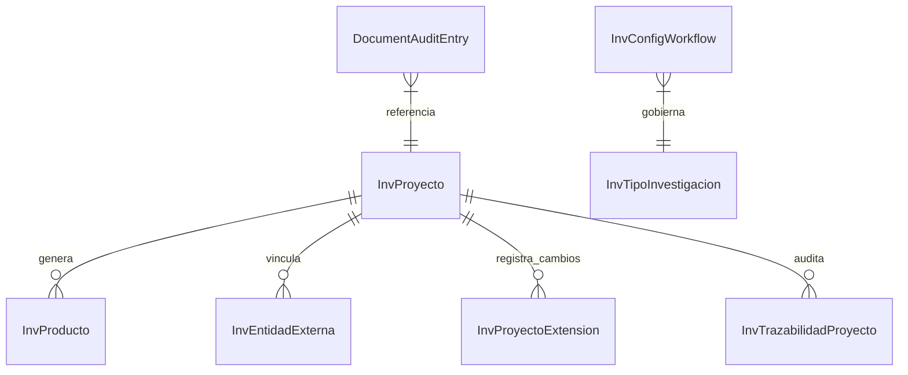

# Arquitectura Nuclear & TRL 2026

## Introducción
La **Arquitectura Nuclear** es la evolución del sistema DIITRA para soportar los requerimientos de excelencia institucional del año 2026 (CACES/SENESCYT). Se basa en un modelo **metadata-driven** que permite la tipificación dinámica de productos, evidencias y actores sin necesidad de cambios estructurales en la base de datos.

## Componentes del Núcleo

### 1. Motor de Metadatos (JSON Persistence)
En lugar de esquemas rígidos, las entidades core (`InvProyecto`, `InvProducto`, `InvEvidencia`) utilizan columnas de tipo JSON para almacenar atributos específicos de cada categoría.
- **Ventaja**: Permite añadir nuevos campos requeridos por normativas externas en tiempo real.
- **Implementación**: Serialización automática en `ProjectsController` y mapeo fluido en el `ProjectWizard`.

### 2. TRL Engine (Technology Readiness Levels)
DIITRA ahora soporta el seguimiento de la madurez tecnológica mediante la escala TRL (1-9).
- **TRL Inicial**: Estado del arte al momento de la postulación.
- **TRL Meta**: Objetivo tecnológico al finalizar el proyecto.
- **Impacto**: Facilita la clasificación de proyectos como "Investigación Aplicada" o "Desarrollo Experimental".

### 3. Vinculación e Innovación Productiva
Se ha integrado un módulo de **Entidades Externas** para formalizar la relación entre la academia y el sector productivo.
- **Catálogo de Aliados**: Base de datos centralizada de empresas, ONGs y entes públicos.
- **Compliance CACES**: Garantiza que los proyectos de innovación tengan una contraparte externa validada, requisito clave para la acreditación.

### 4. Catálogos Dinámicos (API-Driven)
La arquitectura nuclear separa la lógica de negocio de los datos maestros mediante el `CatalogsController`.
- **Tipos de Producto**: Académicos, Tecnológicos, de Innovación o Transferencia.
- **Tipos de Evidencia**: Clasificación automática para el repositorio institucional.
- **Rúbricas & Criterios**: Configuración granular para pares revisores.

### 6. Escudos de Resiliencia (Superior-Proofing)
DIITRA implementa capas de protección para garantizar la supervivencia del sistema ante cambios institucionales:
- **Snapshots Forenses**: Cada documento generado (`DocumentInstance`) guarda una copia JSON de los datos del proyecto en ese instante, protegiendo la verdad histórica.
- **Trazabilidad Temporal**: Registro inmutable de prórrogas y cambios de fechas en proyectos (`inv_proyecto_extensiones`).
- **Notificación Desacoplada**: El sistema de alertas usa un patrón de drivers, permitiendo integrar nuevos medios (Email, WhatsApp) sin afectar el núcleo.

## Diagrama de Datos Nuclear

## Guía de Extensión
Para añadir una nueva tipología de investigación o cambiar un flujo:
1. Insertar el registro en `inv_cat_tipo_proyecto`.
2. Definir las reglas de transición en `inv_config_workflow`.
3. El motor de flujo (`WorkflowEngineService`) aplicará automáticamente las nuevas reglas de validación.
4. El motor de documentos (`DocumentEngine`) detectará automáticamente los nuevos campos para la generación de reportes oficiales.
5. Las notificaciones automáticas se dispararán según el driver configurado en `NotificationService`.
