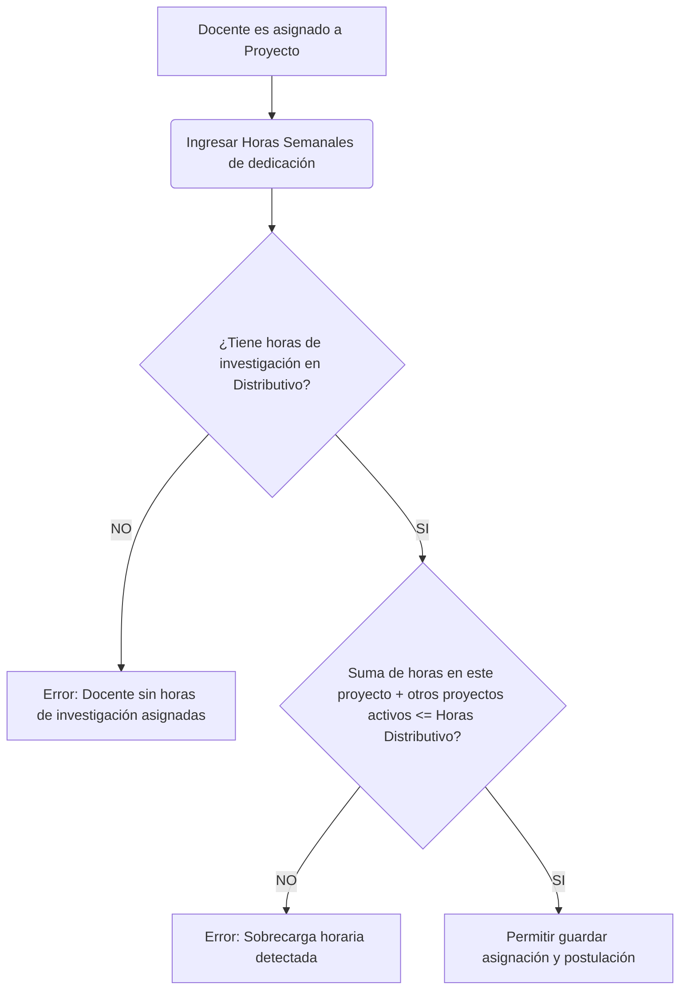

# Carga Horaria de Investigación en el Contexto de la Educación Superior (Ecuador)

Para que un sistema de automatización como **DIITRA** sea aceptado y validado en una auditoría de evaluación externa del **CACES** (Consejo de Aseguramiento de la Calidad de la Educación Superior) o cumpla con el **CES** (Consejo de Educación Superior) y la **SENESCYT**, el control de la **carga horaria de los docentes** es un pilar fundamental.

A continuación, se detalla qué exigen exactamente las autoridades, cómo se evalúa este aspecto y cómo debe implementarse el control técnico en el sistema.

---

## 1. ¿Qué exigen las autoridades (CES, CACES, SENESCYT)?

En el contexto de los **Institutos Superiores Tecnológicos (IST)** de Ecuador, las exigencias normativas se rigen por dos reglamentos principales:
1.  **Reglamento de Régimen Académico (CES)**
2.  **Reglamento de Carrera y Escalafón del Profesor e Investigador del Sistema de Educación Superior**

Bajo esta normativa, se establecen las siguientes reglas de control:

### A. Jornada Laboral y Funciones Sustantivas (RRA - Art. 47/48)
*   Un docente a **Tiempo Completo** cumple una jornada laboral de **40 horas semanales**.
*   Estas 40 horas se distribuyen obligatoriamente en tres funciones sustantivas: **Docencia** (clases, preparación, tutorías), **Vinculación con la Sociedad**, e **Investigación/Gestión Académica**.
*   El distributivo de horas del docente debe ser aprobado al inicio de cada período por el **Consejo Académico Superior (CAS)** de la institución. Las horas asignadas a investigación en este documento son el **límite máximo legal** que el docente puede dedicar a estas actividades.

### B. El Criterio B.1.1 del CACES (Claustro Docente y su Vinculación con la Investigación)
Durante los procesos de evaluación y acreditación institucional, los pares evaluadores del CACES realizan una auditoría estricta de "Cruce de Distributivo":
*   **Cruces de Información**: Los auditores comparan el **Distributivo de Horas Institucional** (aprobado por el CAS) con los **Documentos Oficiales del Proyecto** (Protocolo de Investigación y Resoluciones de Aprobación).
*   **Inconsistencias Penadas**: Si un docente figura en el proyecto de investigación dedicando **12 horas semanales**, pero su distributivo institucional aprobado dice que solo tiene **6 horas** de investigación, el CACES invalida esa evidencia por inconsistencia documental, lo que afecta el puntaje de acreditación del instituto.
*   **Validación de Ejecución**: Mensualmente, los informes de avance deben certificar que el docente efectivamente ejecutó y justificó las horas asignadas mediante evidencias verificables.

---

## 2. Lógica de Negocio y Flujo de Control Requerido en DIITRA

Para que DIITRA cumpla al 100% con estas exigencias, la automatización de la carga horaria debe operar bajo la siguiente lógica:

### Reglas de Validación a Nivel de Sistema (Backend)

Al momento de transicionar un proyecto a estado **"Enviado"** (Postulación finalizada) o **"Aprobado"**, el sistema debe aplicar de forma obligatoria las siguientes restricciones:

1.  **Validación de Carga Académica Activa (SIGAFI Sync)**:
    *   Verificar si el docente está registrado en la tabla `profesores_actividades` para el período académico actual con la subcategoría de investigación (`IdSubcategoria == 7`).
    *   Si no tiene registros, el sistema no debe permitir que se le asigne al equipo del proyecto.
2.  **Validación de Tope de Carga Horaria**:
    *   Consultar el total de horas de investigación asignadas al docente en el distributivo de ese período:
        $$\text{Horas Max} = \text{profesores\_actividades.HorasSemana}$$
    *   Sumar las horas semanales del docente asignadas en el proyecto actual y en todos los demás proyectos del mismo período académico que estén en estado `"Enviado"`, `"Aprobado"` o `"En Ejecución"`:
        $$\text{Horas Asignadas} = \sum \text{inv\_proyectos\_profesores.horasSemanales}$$
    *   Si $\text{Horas Asignadas} > \text{Horas Max}$, impedir el envío del proyecto y lanzar una excepción de sobrecarga de distributivo.
3.  **Inmutabilidad Documental (Snapshot Forense)**:
    *   Al momento de firmar y emitir el protocolo oficial del proyecto, las horas asignadas (`HorasSemanales`) deben quedar selladas en el JSON inmutable (`data_snapshot_json` en `inv_document_audit`) para garantizar la trazabilidad ante futuras auditorías del CACES, incluso si el docente cambia de distributivo al siguiente ciclo.

---

## 3. Conclusión

Para cumplir con las autoridades ecuatorianas (CES y CACES):

*   **No basta con registrar los nombres de los investigadores.** El sistema debe ser capaz de contrastar activamente las horas que se pretenden declarar en un proyecto contra las horas contratadas y autorizadas en el distributivo académico de SIGAFI.
*   El flujo de validación implementado en `WorkflowEngineService.cs` y visualizado dinámicamente en la interfaz de usuario responde directamente a esta exigencia de acreditación.
